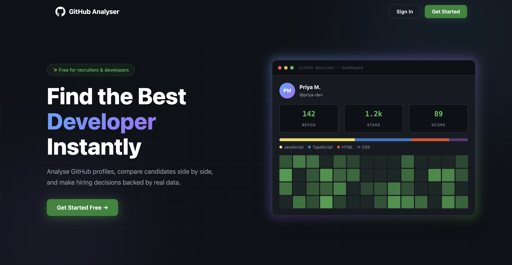
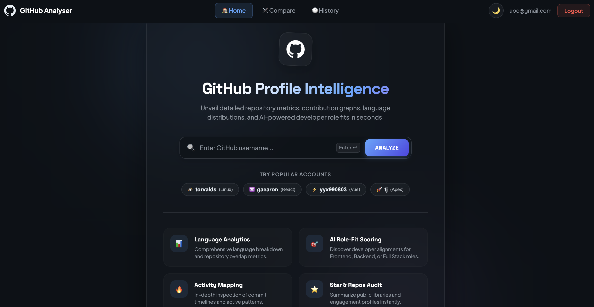
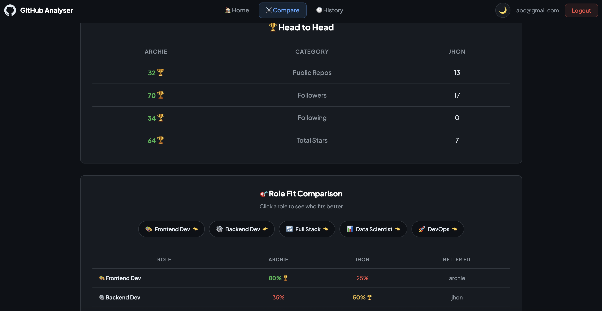
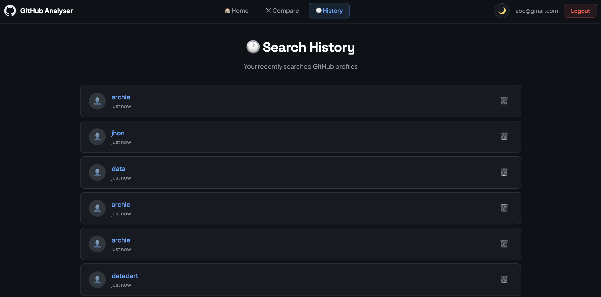
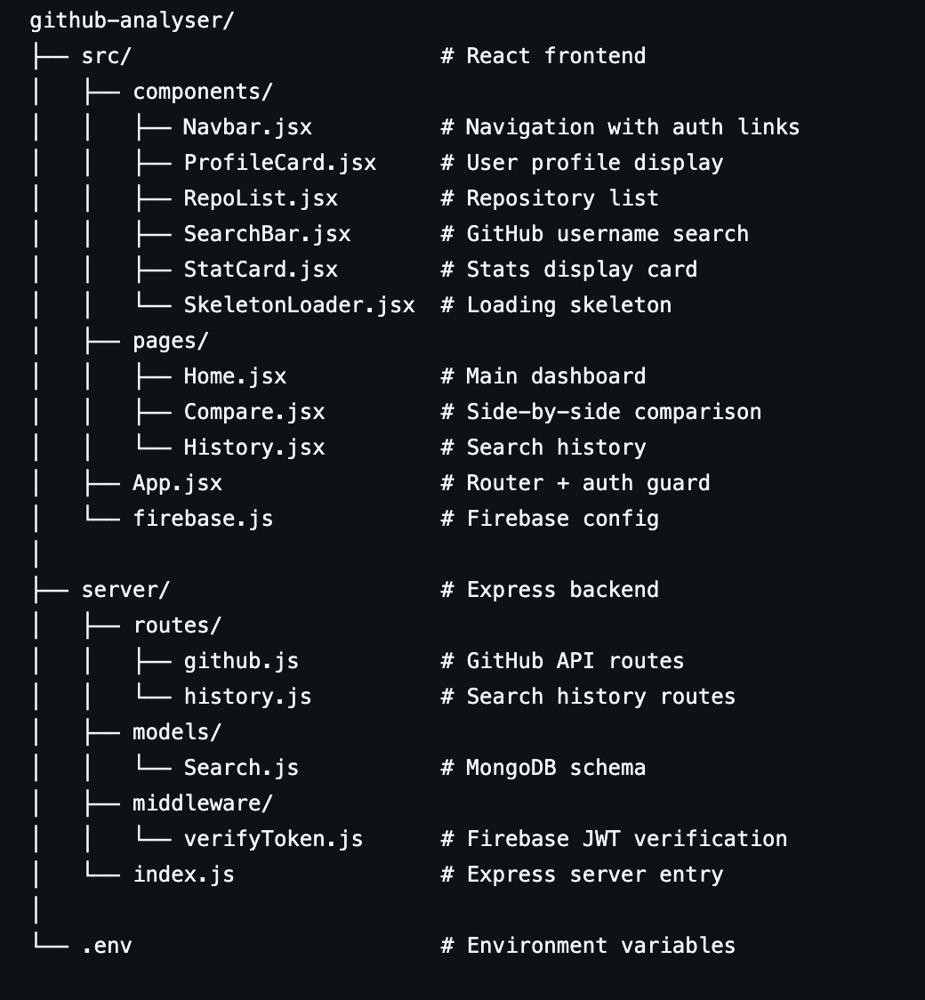

# 🔍 GitHub Analyser

> A full-stack web application that helps recruiters and developers analyse GitHub profiles, compare candidates side by side, and make data-driven hiring decisions.

## 🌐 Live Demo
**[github-analyser.vercel.app](https://your-live-link.com)**

---

## 📸 Screenshots

| Landing Page |  Dashboard |
|-------------|------------------|
|  |  |

| Compare Page | History Page |
|-------------|--------------|
|  |  |

---

## ✨ Features

- 🔐 **Firebase Authentication** — secure email/password login and signup
- 🔍 **Profile Analysis** — deep insights into any GitHub profile instantly
- 📊 **Language Chart** — donut chart showing most used programming languages
- 🔥 **Contribution Heatmap** — GitHub-style activity calendar for any user
- ⚔️ **Side-by-Side Comparison** — compare two developers with head-to-head stats and winner detection
- 🕐 **Search History** — every search saved to MongoDB per user account
- 🌙 **Dark / Light Mode** — toggle with preference saved to localStorage
- 📈 **Stats Dashboard** — repositories, followers, following, total stars at a glance
- 🛡️ **JWT Auth on Backend** — Firebase tokens verified on every API call
- ⚡ **Fast & Secure** — GitHub API calls made server-side, token never exposed

---

## 🛠️ Tech Stack

### Frontend
| Technology | Purpose |
|-----------|---------|
| React 19 + Vite | UI framework and build tool |
| React Router v7 | Client-side routing |
| Recharts | Language donut chart |
| React Hot Toast | Toast notifications |
| CSS / Inline Styles | GitHub-inspired dark theme |

### Backend
| Technology | Purpose |
|-----------|---------|
| Node.js + Express | REST API server |
| MongoDB + Mongoose | Database for search history |
| Firebase Admin SDK | JWT token verification |
| Axios | GitHub API requests |
| CORS | Security and config |

### Services
| Service | Purpose |
|---------|---------|
| Firebase Auth | User authentication |
| MongoDB Atlas | Cloud database |
| GitHub REST API | Profile and repo data |

---

## 🏗️ Project Structure

